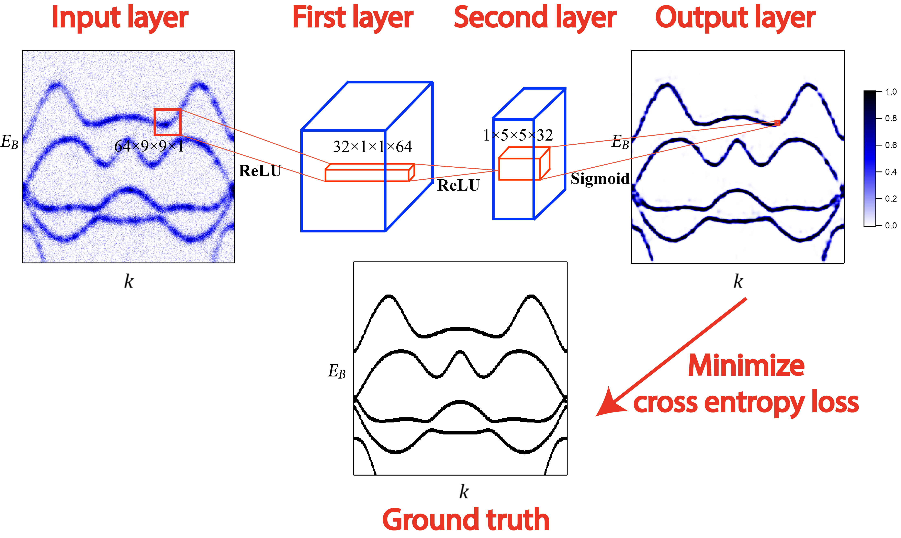

[TensorFlow] Super-Resolution CNN (SR-CNN) on ARPES data
=====

TensorFlow implementation of 'Image Super-Resolution using Deep Convolutional Network' [1] applied on angle-resolved photoemission spectroscopy (ARPES) data. The goal is to reproduce the results in Ref. [2] as a practice.

The package is adapted from <a href="https://github.com/YeongHyeon/Super-Resolution_CNN">YeongHyeon's implementation of SR-CNN</a> in order to perform denoising and fine feature extraction on angle-resolved photoemission spectroscopy (ARPES). 

## Architecture

    
  
The architecture of the Super-Resolution Network (SRCNN) on ARPES data.

The architecture consists of three convolutional layers with kernel sizes of 9x9, 1x1, 5x5, and nonlinear activation functions of ReLu, ReLu, sigmoid, respectively. The simulated ARPES data is fed to the CNN as inputs, while the TB data is used as the ground truth. The cross entropy loss is calculated between the outputs and the ground truth, and back propogated to update the weights and biases of each layer using an Adam optimizer. In addition to the training, we have generated separate validation datasets for calculating validation loss at the end of each epoch in comparison with training loss to monitor the learning curve. Eventually the trained SR-CNN is applied to the final testing dataset, as well as the actual ARPES experiment data

## Results

    
  
Reconstructed image in each iteration (1k, 10k, 100k iterations).

      
  
Comparison between the input (Bicubic Interpolated), reconstructed image (by SRCNN), and target (High-Resolution) image.

## Requirements
* Python 3.6.8  
* Tensorflow 1.14.0  
* Numpy 1.14.0  
* Matplotlib 3.1.1  

## Reference
[1] Image Super-Resolution Using Deep Convolutional Networks, Chao Dong et al., https://ieeexplore.ieee.org/abstract/document/7115171/  
[2] Super resolution convolutional neural network for feature extraction in spectroscopic data, H. Peng et al., https://aip.scitation.org/doi/10.1063/1.5132586
